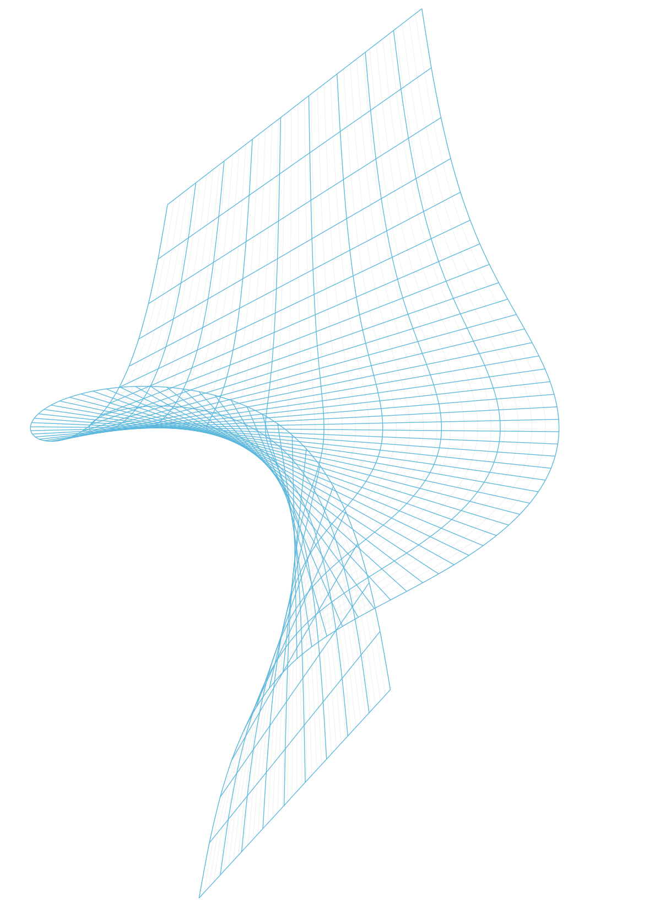

# Welcome to Tikz-Python!

{align=right width=40%} 

Tikz-Python is intended to be an easy-to-use, no-nonsense python package meant to serve as an interface to TikZ code. With Tikz-Python, you can have your beautiful vector graphics and eat it too! (erh, maybe).  


Install it below as follows:
```
pip install tikz-python
```

Want to see some nice examples of what this package can do? See [here](examples.md).

## Usage 
Suppose we want to create a sphere. We can achieve this as follows.
```python
from tikzpy import TikzPicture  

tikz = TikzPicture() # Initialize empty canvas
tikz.circle((0, 0), 3, options="thin, fill=orange!15")

# Draw two arcs to give 3d-illusion
tikz.arc((3, 0), 0, 180, x_radius=3, y_radius=1.5, options="dashed")
tikz.arc((-3, 0), 180, 360, x_radius=3, y_radius=1.5)

tikz.show()  # Displays a pdf of the drawing to the user
```
which produces
 

## Why Tikz-Python 

With Tikz-Python, you generate TikZ code by writing python code. And Python is much nicer than TeX. 

* Instead of spending a lot of time tediously writing messy, unreadable TikZ code to generate your desired figure, 
you can use TikZ-Python to quickly create your figure *as a Python script*. Your Python code will definitely be much 
more modular and extensible than the raw TikZ code you'd end up writing. 

* At any time, you can compile and look at your figure in a sandbox environment by calling `TikzPicture.show()`

* With a sandbox environment for compilation, compiling will be faster versus you editing and re-compiling your tikz code directly in whatever 100-page document you're working in.

* Once you're happy with your drawing, you can copy the generated TikZ code and paste it into your LaTeX document. Or, you can 
save your code to a file by calling `TikzPicture.write(file_destination)`.

Additionally, Tikz-Python encodes lines, circles, rectangles, etc. as data structures. These data structures have useful properties and methods
that can be used to create other drawings.

For example, suppose I want to create a line and two labels at the ends. The code below achieves this
```python
from tikzpy import TikzPicture

tikz = TikzPicture()
line = tikz.line((0, 0), (1, 1), options="thick, blue, o-o")
start_node = tikz.node(line.start, options="below", text="Start!")
end_node = tikz.node(line.end, options="above", text="End!")
tikz.show()  # Displays a pdf of the drawing to the user
```
which produces 

Saving the line as a variable `line` allows us to pass in `line.start` and `line.end` into the node positions, so we don't have to type out the exact coordinates. 
This is great, because it makes our code more modular and therefore easier to change. With TikZ alone, you'd need to type out exact coordinates, and update every single one each time you make a minor adjustment to your code.

If we were working in an interactive python shell with the code above, we would be able to see that these functions return classes with useful attributes:
```python
>>> line.start
(0,0)
>>> line.end
(1,1)
>>> start_node.text
"Start!"
```
Additionally, you can `print` your tikz object to see the code generated

```python
>>> print(tikz)
\begin{tikzpicture}
    \draw[thick, blue, o-o] (0, 0) to (1, 1);
    \node[below] at (0, 0) { Start! };
    \node[above] at (1, 1) { End! };
\end{tikzpicture}
```
which you can then use to export to your project.


## Background
TikZ is itself a wrapper of the TeX-based graphics package PGF (see [here](https://github.com/pgf-tikz/pgf/blob/master/tex/generic/pgf/frontendlayer/tikz/tikz.code.tex)), and it is commonly used in LaTeX documents to produce beautiful graphics.
However, the power of TikZ comes with a tradeoff: it is extremely tedious to use, learn, understand, and iterate on. 

The main problem is Tikz is that, even though Tikz is so powerful, it is often the case that 
nonexperts who use TikZ end up producing subpar images. 
The reason for this is because of the fact that in order to create beautiful images with TikZ, you also need to deeply understand 
LaTeX, TeX, PGF, and the history, bugs, cryptic error messages, and ridiculous quirks (and there are *many* quirks) of these languages. 
This takes years of practice and for the average person this is not realistic or desirable.

This can be seen in research papers; even in high quality research papers, the graphics are usually not that great and it totally makes sense why. 
It's probably because the authors are too busy being an expert in their own field of work to sit down and read a 1300 page manual on TikZ.

## About
I started this project after realizing 

* most TikZ code is repetitive.

* TikZ was designed smart; it has an inherent object oriented pattern in its usage which we can exploit and automate.

* I really hate writing TeX and TikZ code.

I wrote the first version of this as a math undergraduate while writing a large set of notes. As a heavy user of LaTeX, TikZ, PGF, I knew how to design the project to enable efficient development of TikZ code.
Then I became a professional software engineer, and I refactored the code to a modern python package while maintaining the original desired goals of the package. 


